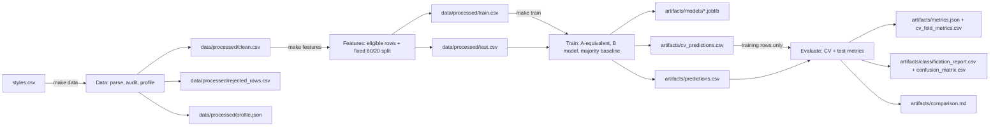

# Fashion Classifier - living plan

## Assumptions
- Repository B is `Practicing-AI-Assisted-Workflows`, the current role-workflow repository. Its existing root `styles.csv` is the only runtime dataset and must remain unmodified.
- `styles.csv` is available at the repository root in a clean clone. No image files or external downloads are required.
- Repo A's split contract is `test_size=0.2`, `random_state=42`, and no stratification. Preserve that logic for the A-equivalent and B models on the exact same eligible rows.
- For a meaningful supervised color task, rows with missing `baseColour` are excluded from modeling, not relabeled as a learnable `Unknown` color. Report their count. Consequently, the historical Repo A score (which treated missing targets as `Unknown`) is context, not a directly matched result.
- GNU Make and Python are installed and on `PATH`. `make` is the public interface on Windows too; Makefile recipes must use Python module commands and avoid POSIX-only shell utilities. `PYTHON` can be overridden for launchers such as `py -3`.

## Base - Pipeline diagram

- Stages are separate `python -m fashion_classifier.<stage>` entry points and communicate through explicit CSV/JSON/model artifacts, not one another's private imports. The only shared code is small configuration/path handling and pure utilities where needed.
- Repo B adds a package, deterministic disk handoffs, data-quality accounting, fixture-based tests, and training-only preprocessing. Repo A's one-script flow becomes independently rerunnable stages.
- Keep `baseColour` for a like-for-like task. Compare an A-equivalent gender+season Random Forest and the expanded B model on identical rows and split IDs. Also show a majority-class baseline; distinguish this controlled comparison from Repo A's historical ~0.23 score because its missing-target treatment differs.
- Omit `productDisplayName` entirely from model features. This sacrifices potentially useful legitimate text signal but avoids color-word leakage and fragile attempts to mask color synonyms. B instead uses non-name metadata unavailable to Repo A: `articleType`, `usage`, and `year` in addition to `gender` and `season`.
- Omit the Polars benchmark. The old one-shot timing did not establish equivalent parsing/workloads or repeatable performance and does not support the classifier goal; removing it keeps dependencies and scope small. Revisit only as a separate, controlled benchmark project.

## Stage 1 - Skeleton and configuration
### Goal
Establish the package, environment-driven paths, Windows-usable Makefile interface, and pytest marker conventions before pipeline behavior is added.

### Proposed changes (files, key function signatures, config)
- `fashion_classifier/__init__.py`; `fashion_classifier/config.py`: `load_config() -> Config`, with environment-backed defaults for `FASHION_INPUT=styles.csv`, `FASHION_PROCESSED_DIR=data/processed`, `FASHION_ARTIFACTS_DIR=artifacts`, `FASHION_SEED=42`, and `FASHION_TEST_SIZE=0.2`.
- `fashion_classifier/paths.py`: resolve/create configured output directories; never embed a machine-specific absolute path.
- `Makefile`: declare `.PHONY`; targets `install`, `test`, `lint`, `format`, `clean`, `data`, `features`, `train`, `evaluate`, and `run`. Use `python -m pip install -r requirements.txt`, `python -m pytest -q`, `python -m ruff check fashion_classifier tests`, `python -m ruff format fashion_classifier tests`, and Python module commands for the pipeline stages. `run` has prerequisites only: `data features train evaluate`. Keep recipes limited to invoking commands, with no shell logic; use Python for cleanup so it works on Windows. Leave command output visible.
- `requirements.txt`: runtime/test dependencies (`pandas`, `scikit-learn`, `pytest`, `ruff`); `pytest.ini`: register `unit`, `regression`, and `integration` markers. Add a `.gitignore` rule for generated processed data/artifacts, while retaining the supplied raw CSV.
- `.github/workflows/tests.yml`: CI runs `make test` and `make lint`.
- Public functions have type hints and short docstrings; `ruff check` enforces unused-import cleanliness. Containerization, Docker targets, and a Dockerfile are out of scope.

### Architecture / boundaries (what reads/writes what; pure functions vs I/O)
Configuration parsing is pure apart from reading environment variables. Path creation is a small I/O boundary. Make invokes stages; stages own their inputs/outputs. `make install` installs from the checked-in requirements file. `make clean` invokes a Python cleanup module that removes generated outputs plus `__pycache__` and `.pytest_cache`, never `styles.csv` or test fixtures. On Windows, install GNU Make and put `make` on `PATH`; recipes must not depend on `rm`, `cp`, shell-specific environment assignment, or a Unix shell.

### Automated tests (Unit / Regression / Integration, with fixtures and edge cases)
- Unit: configuration defaults, environment overrides, relative-path resolution, and directory creation.
- Regression: assert documented defaults (seed 42, 20% holdout, root CSV) remain stable.
- Integration: invoke a stage module with a temporary output directory and assert a clear missing-input error. CI runs `make test` and `make lint`; format checks are performed with `make format` when code is ready to be formatted.

### Manual Smoke Test (What we're proving / Terminal (pasteable make commands, labelled Terminal 1/2 if needed) / Watch for (expected logs, files, example metric output) / Stop (Ctrl+C or failure criteria))
- What we're proving: a fresh Windows checkout can install dependencies and resolve the public Make targets using GNU Make.
- Terminal (PowerShell): `make --version`, `make install`, then `make lint`.
- Watch for: GNU Make version, visible pip activity, successful dependency installation and Ruff check, and no Unix-command or absolute-path assumptions. No metrics are expected at this stage.
- Stop: stop on missing `make`/Python, install failure, or a recipe invoking an unavailable shell utility; install/configure GNU Make and Python before proceeding.

## Stage 2 - Data loading, cleaning, and profiling
### Goal
Turn the supplied CSV into a deterministic, auditable processed file while making malformed rows, schema problems, and missingness visible.

### Proposed changes (files, key function signatures, config)
- `fashion_classifier/data.py`: `load_and_clean(input_path: Path, processed_dir: Path) -> DataOutputs`; `profile_data(frame: pd.DataFrame) -> dict[str, object]`.
- `fashion_classifier/data_stage.py`: module entry point. Require `baseColour`; tolerate absent optional predictors by adding null columns with a warning. Parse malformed over-wide rows with pandas' Python-engine bad-line callback, retain rejected source text/reason in `rejected_rows.csv`, and report accepted/rejected counts. Keep feature nulls for train-fitted imputers; do not fill missing targets into an artificial color class.
- Outputs: `data/processed/clean.csv` with stable accepted-row IDs, `rejected_rows.csv`, and `profile.json`. The profile includes row counts, schema, missing counts, and target counts as machine-readable data; no plot is generated.

### Architecture / boundaries (what reads/writes what; pure functions vs I/O)
The stage reads only `FASHION_INPUT` and writes only `FASHION_PROCESSED_DIR`. Parsing and serialization are I/O; profile calculation is pure. No model fitting happens here. Missing predictor values stay missing for later train-only preprocessing. A missing target column is a clear fatal schema error; missing individual target values are counted and retained in the cleaned file, then excluded at feature/split creation.

### Automated tests (Unit / Regression / Integration, with fixtures and edge cases)
- Unit: profile counts and required-column validation.
- Regression: fixed fixture's accepted/rejected counts and missing counts; malformed rows cannot silently disappear without audit output.
- Integration: small CSV fixture with an extra-field malformed row, nulls in `baseColour`, `season`, `usage`, `productDisplayName`, and `year`; assert clean/rejected/profile files and logs. A fixture lacking `baseColour` must fail clearly; absent optional columns must be reported and tolerated.

### Manual Smoke Test (What we're proving / Terminal (pasteable make commands, labelled Terminal 1/2 if needed) / Watch for (expected logs, files, example metric output) / Stop (Ctrl+C or failure criteria))
- What we're proving: the real root CSV can be parsed and its data loss/missingness is auditable.
- Terminal (PowerShell): `$env:FASHION_INPUT = 'styles.csv'` then `make data`.
- Watch for: accepted and rejected row counts, missing `baseColour` count, and the schema/profile summary in the terminal; `data/processed/clean.csv`, `data/processed/rejected_rows.csv`, and `data/processed/profile.json` appear.
- Stop: stop if required `baseColour` is absent, the parser fails, rejected rows are not accounted for, or the source CSV is altered.

## Stage 3 - Features and deterministic split
### Goal
Create one persisted train/test split that is reused by every model and excludes target leakage by construction.

### Proposed changes (files, key function signatures, config)
- `fashion_classifier/features.py`: `make_split(clean_path: Path, processed_dir: Path, test_size: float, seed: int) -> tuple[Path, Path]`.
- `fashion_classifier/features_stage.py`: module entry point. Drop rows with missing `baseColour` from supervised data and log their count. Use `train_test_split(test_size=0.2, random_state=42, stratify=None)` by default, matching Repo A's split logic. Write `train.csv` and `test.csv` with row ID, target, and allowed predictors only.
- Predictor allowlist: `gender`, `season`, `usage`, `articleType`, `year`. Explicitly exclude `id` and `productDisplayName`.

### Architecture / boundaries (what reads/writes what; pure functions vs I/O)
Read only `clean.csv`; write only `train.csv` and `test.csv` under the configured processed directory. Split selection is deterministic and persisted; no encoder, imputer, or target-derived grouping is fit here. Retaining IDs makes it possible to prove all models use the same holdout records.

### Automated tests (Unit / Regression / Integration, with fixtures and edge cases)
- Unit: split size/IDs, target-missing exclusion, and feature allowlist.
- Regression: with the fixture and seed 42, assert exact train/test row IDs remain stable; train/test IDs are disjoint and cover every eligible row once.
- Integration: absent optional feature columns become null-valued columns and still produce split files; no target or name token appears in the predictor columns.

### Manual Smoke Test (What we're proving / Terminal (pasteable make commands, labelled Terminal 1/2 if needed) / Watch for (expected logs, files, example metric output) / Stop (Ctrl+C or failure criteria))
- What we're proving: valid labeled rows are split once, reproducibly, and shared by all model variants.
- Terminal (PowerShell): `make features`.
- Watch for: eligible/missing-target counts, 80/20 row counts, seed 42, and the two split files. A rerun with unchanged inputs produces the same counts and IDs.
- Stop: stop if split IDs overlap, rows are lost/duplicated, `productDisplayName` is present, or the split differs between repeated runs.

## Stage 4 - Training and prediction artifacts
### Goal
Train a faithful Repo A reference model and a leakage-resistant, imbalance-aware B model on the same persisted split; include a simple majority baseline.

### Proposed changes (files, key function signatures, config)
- `fashion_classifier/modeling.py`: `build_pipeline(feature_columns: Sequence[str], class_weight: str | None = None) -> Pipeline`; `cross_validate_models(train_path: Path, output_path: Path, seed: int) -> Path`; `fit_models(train_path: Path, test_path: Path, artifact_dir: Path, seed: int) -> Path`.
- `fashion_classifier/train_stage.py`: module entry point. A-equivalent reference must match Repo A's estimator settings exactly: `RandomForestClassifier(n_estimators=100, max_depth=10, random_state=42)`, using only `gender` and `season` with no class weighting. B uses those tree settings on all allowed metadata with `class_weight="balanced_subsample"`. Baseline: `DummyClassifier(strategy="most_frequent")`.
- Use a scikit-learn `ColumnTransformer`/`Pipeline`: categorical imputation and `OneHotEncoder(handle_unknown="ignore")`; numeric median imputation for `year`. Fit every transformer on training rows only. On the outer training partition only, create five-fold `StratifiedKFold(shuffle=True, random_state=seed)` out-of-fold predictions for A-equivalent and B. Save `artifacts/cv_predictions.csv`, with row ID, fold, true label, and both predictions. Then fit each final pipeline on the full outer training partition and predict the fixed test split once into `artifacts/predictions.csv`; save final models under `artifacts/models/`.

### Architecture / boundaries (what reads/writes what; pure functions vs I/O)
Train reads the two feature split files and writes fitted model artifacts, cross-validation out-of-fold predictions from training rows, and final test predictions. CV must never read or score the test split. It does not read the raw CSV or call the data/features stages. Prediction through each fitted pipeline must accept an unseen category without refitting or crashing. No resampling or rare-label grouping in the first version; class weights change training importance without altering either validation or test prevalence.

### Automated tests (Unit / Regression / Integration, with fixtures and edge cases)
- Unit: pipeline column selection, missing-value transforms, fixed estimator settings, and five fold creation from training rows only.
- Regression: train twice on the fixture and assert deterministic split IDs/fold assignments/predictions; assert product names never reach estimator inputs and every outer-training row appears in exactly one OOF prediction.
- Integration: fit/save/load using the fixture; predict on an unseen category and null predictor values; assert test prediction IDs equal persisted test IDs and both CV and test prediction artifacts exist.

### Manual Smoke Test (What we're proving / Terminal (pasteable make commands, labelled Terminal 1/2 if needed) / Watch for (expected logs, files, example metric output) / Stop (Ctrl+C or failure criteria))
- What we're proving: all candidates train reproducibly and produce predictions for the same held-out products.
- Terminal (PowerShell): `make train`.
- Watch for: labeled row counts and model names in logs; `artifacts/models/` contains the saved pipelines, `artifacts/cv_predictions.csv` has one OOF prediction per outer-training row for both candidates, and `artifacts/predictions.csv` contains one row per test product. Example output identifies A-equivalent, B, and majority predictions without claiming a score before evaluation.
- Stop: stop on train/test overlap, fit-time preprocessing of holdout rows, missing prediction rows, or unseen-category errors.

## Stage 5 - Evaluation and Repo A comparison
### Goal
Make improvement measurable and honest using imbalance-aware metrics, per-class diagnostics, and a directly controlled A-versus-B comparison.

### Proposed changes (files, key function signatures, config)
- `fashion_classifier/evaluation.py`: `evaluate_predictions(predictions_path: Path, cv_predictions_path: Path, artifact_dir: Path) -> dict[str, object]`.
- `fashion_classifier/evaluate_stage.py`: module entry point. Write `metrics.json`, `cv_fold_metrics.csv`, `cv_classification_report.csv`, `classification_report.csv`, `confusion_matrix.csv`, and `comparison.md`; no images.
- Report fixed-test accuracy, macro F1 (primary), weighted F1, balanced accuracy, and per-class precision/recall/F1/support for majority, A-equivalent, and B. Include the test confusion matrix and class supports. Use explicit labels and zero-division handling for rare/unpredicted classes.
- From `cv_predictions.csv`, calculate paired A-equivalent and B macro F1 for each of five folds, then report each fold, the mean and sample standard deviation of fold scores, and the mean paired B-minus-A-equivalent delta. For each fold, macro F1 uses the classes present in that fold's validation truth so a class with zero validation support is not treated as a measured zero score.
- Rare-class policy: if an outer-training class has fewer than five members, still use the required five `StratifiedKFold` splits; sklearn's stratification is best-effort for that class and may place its members in fewer than five validation folds. Do not merge/drop labels or suppress the warning. Mark every class with fewer than five outer-training examples as low-support in `cv_classification_report.csv`, show its support and pooled out-of-fold per-class metrics, and calculate an additional pooled OOF macro F1 over all outer-training classes. Every training row must occur exactly once in OOF predictions. If the outer training partition has fewer than five rows total, fail with an actionable error instead of silently reducing folds.
- Comparison includes the historical Repo A accuracy (~0.23, qualified), controlled A-equivalent, majority baseline, B, five fold scores, CV mean/sample standard deviation, mean CV delta, fixed-test metrics, and test B-minus-A-equivalent macro-F1 delta. Claim improvement only if both the CV mean delta and fixed-test delta are positive; if they disagree, report the result as inconclusive. The fixed test set is evaluated once and is never used for tuning, feature selection, or threshold/model selection.

### Architecture / boundaries (what reads/writes what; pure functions vs I/O)
Evaluation reads the OOF predictions and final test predictions and writes CSV/JSON reports only. Metric computation is pure. Keep target-missing exclusions, malformed-row counts, and rare-class supports visible in the comparison context. CV estimates performance only within the outer training partition. The fixed test delta is read once for final confirmation; disagreement with the CV mean delta is explicitly inconclusive. Never revise features/model based on test results and then report the same test score as unbiased.

### Automated tests (Unit / Regression / Integration, with fixtures and edge cases)
- Unit: metric calculations against hand-checkable labels, including a class with zero predicted instances; five-fold score mean/sample standard deviation and paired deltas.
- Regression: stable report schema, class ordering, and deltas; majority baseline metrics match the fixture's majority label. Include a class with fewer than five outer-training members and assert it is flagged low-support, is not merged/dropped, appears in pooled OOF reporting, and its rows each receive exactly one OOF prediction across five folds.
- Integration: evaluate persisted fixture CV/test predictions and assert all CSV/JSON reports exist, each fold's supports are auditable, test class supports sum to test rows, and `comparison.md` distinguishes historical Repo A from the controlled rerun. Tests verify that test rows never appear in CV predictions and that the decision is "inconclusive" when CV/test deltas disagree. Tests validate output correctness, not a quality threshold on a tiny fixture.

### Manual Smoke Test (What we're proving / Terminal (pasteable make commands, labelled Terminal 1/2 if needed) / Watch for (expected logs, files, example metric output) / Stop (Ctrl+C or failure criteria))
- What we're proving: the real dataset yields readable metrics and an explicit, apples-to-apples Repo A comparison.
- Terminal (PowerShell): `make evaluate`.
- Watch for: terminal output lists all five paired CV fold scores, CV mean/sample standard deviation and mean delta, then the one-time fixed-test metrics for majority/A-equivalent/B and test delta. `cv_fold_metrics.csv`, `cv_classification_report.csv`, `classification_report.csv`, `confusion_matrix.csv`, `metrics.json`, and `comparison.md` appear under `artifacts/`. Rare colors under five training examples are explicitly marked with pooled OOF support/metrics; no images are generated.
- Stop: stop if CV includes test rows, any training row is missing or duplicated in OOF predictions, rare classes are silently dropped/merged, the test set is consulted for tuning, or improvement is claimed when either required delta is non-positive.

## Stage 6 - End-to-end, CI, and handoff documentation
### Goal
Make the complete workflow reproducible from a clean clone, testable without the full dataset, and straightforward for the next Builder/Tester to operate using only this repository and this plan.

### Proposed changes (files, key function signatures, config)
- `fashion_classifier/clean_stage.py`: cross-platform generated-output cleanup entry point.
- `tests/fixtures/styles_small.csv`; `tests/unit/`, `tests/regression/`, `tests/integration/`; mark every test with one registered marker. Integration tests set temporary input/output environment variables and invoke stage modules in subprocesses.
- `.github/workflows/tests.yml`: install dependencies, run `make test` and `make lint` on pushes/PRs. The fixture suite must not download or read the full dataset.
- `README.md`: setup, Windows GNU Make prerequisite, environment configuration, stage commands, generated artifacts, model limitations, manual smoke test commands, and Repo A vs B results copied from an actual run with dataset/seed/split details.
Makefile stage map:

| Make target | Command | Exact module | Source file |
| --- | --- | --- | --- |
| `data` | `python -m fashion_classifier.data_stage` | `fashion_classifier.data_stage` | `fashion_classifier/data_stage.py` |
| `features` | `python -m fashion_classifier.features_stage` | `fashion_classifier.features_stage` | `fashion_classifier/features_stage.py` |
| `train` | `python -m fashion_classifier.train_stage` | `fashion_classifier.train_stage` | `fashion_classifier/train_stage.py` |
| `evaluate` | `python -m fashion_classifier.evaluate_stage` | `fashion_classifier.evaluate_stage` | `fashion_classifier/evaluate_stage.py` |
| `clean` | `python -m fashion_classifier.clean_stage` | `fashion_classifier.clean_stage` | `fashion_classifier/clean_stage.py` |

- `run` is prerequisites only: `run: data features train evaluate`; it has no orchestration module or recipe. `make clean` removes only generated processed/artifact outputs plus `__pycache__` and `.pytest_cache`. Add no benchmark framework or extra CLI dependency.

### Architecture / boundaries (what reads/writes what; pure functions vs I/O)
End-to-end execution is the same separately runnable file-handoff pipeline as individual targets; Make's `run` target has prerequisites only and invokes the stage targets in order. CI runs both `make test` and `make lint`. Manual smoke tests are human-run Make targets that print logs and leave inspectable CSV/JSON artifacts; they are not pytest. Default config is usable from repository root, while environment overrides support temporary fixture paths and alternate output directories. README comparison reports the controlled rerun, five-fold CV evidence, and historical caveat.

### Automated tests (Unit / Regression / Integration, with fixtures and edge cases)
- Unit: all pure config, parsing/profile, split, pipeline, and metric helpers.
- Regression: pinned split IDs/defaults, output schema, no text/name feature leakage, deterministic predictions/folds, rare-class reporting and OOF coverage, and malformed-row accounting.
- Integration: run all stage modules against the small fixture in fresh temporary directories; include malformed rows, missing required target column, missing target/features, nulls, unseen categories, a class with fewer than five outer-training examples, CV/test separation, and artifact cleanup that preserves the input fixture. CI runs `make test` and `make lint`; tests never rely on full `styles.csv`.

### Manual Smoke Test (What we're proving / Terminal (pasteable make commands, labelled Terminal 1/2 if needed) / Watch for (expected logs, files, example metric output) / Stop (Ctrl+C or failure criteria))
- What we're proving: a clean clone with only the repository and `styles.csv` can complete the entire user-facing workflow and be cleaned safely.
- Terminal (PowerShell): `$env:FASHION_INPUT = 'styles.csv'` then `make run`; inspect `data/processed/` and `artifacts/`; then `make clean`.
- Watch for: visible data counts, split counts, candidate names, five-fold CV evidence, measured test metric table, and CSV/JSON comparison reports on disk; `make clean` removes generated outputs plus `__pycache__` and `.pytest_cache` but leaves `styles.csv`, source, and fixtures. Copy measured values and exact configuration into README.
- Stop: stop if any stage requires a manual Python invocation, an external download, a developer-specific path, hidden/suppressed logs, or cleanup deletes raw input.

## Risks and design concerns
- **Target leakage:** product names often include color words. Do not use `productDisplayName`, even with a masking list: aliases, spelling variants, and accidental omissions make masking brittle. If text is explored later, it must be an explicitly separate experiment with tested target-color masking and must not replace the primary score.
- **Apples-to-apples limits:** Repo A filled missing target colors with `Unknown`; the primary B evaluation excludes unlabeled rows. Re-run the A-equivalent model on B's eligible rows and exact split as the controlled comparison. Show the historical ~0.23 only as a qualified reference, never imply identical preprocessing.
- **Imbalance and rare classes:** use `class_weight="balanced_subsample"` for B, retain natural test prevalence, and report macro/weighted F1, balanced accuracy, support, and confusion matrix. Do not resample the holdout or merge rare colors in v1; a rare class may have weak/zero recall and should remain visible.
- **Model improvement is empirical:** adding metadata is a sound non-leaky hypothesis, not a guaranteed win on every split. Macro F1 on one fixed holdout can be noisy. Publish actual values and do not claim improvement unless B beats the A-equivalent macro F1; any later tuning must use cross-validation on training data, with the holdout used once for final evaluation.
- **Malformed CSV semantics:** audit skipped rows and record source text/reason where the parser supports it. Test extra-field rows explicitly; document limitations for malformed quoting rather than silently claiming every corrupt byte sequence is recoverable.
- **Windows Make availability:** GNU Make is not guaranteed on Windows. Document it as a prerequisite and keep recipes shell-neutral; `make` remains the public workflow once installed. Confirm that `make clean` uses Python filesystem APIs, not Unix commands.
- **EDA scope:** retain concise shape/schema/missingness/target-count summaries in logs and `profile.json`; generate no chart images. Cut full-data head/info dumps, arbitrary handbag filtering, redundant grouped tables, prediction-distribution plots, segment accuracy claims from tiny groups, and timing charts. EDA is descriptive and must not inspect the test labels to influence modeling.
- **Rare-class cross-validation:** five-fold stratification cannot place fewer than five examples of a class in every validation fold. Keep all five folds, mark classes with fewer than five outer-training examples, report their pooled OOF metrics/support, and include all labels in the pooled report. Per-fold macro F1 uses labels actually present in that fold's validation truth; report this definition alongside fold scores so varying fold supports are transparent. Fail clearly only if fewer than five total outer-training rows make five folds impossible.
- **Evidence interpretation:** CV mean and fixed-test deltas must both be positive for an improvement claim. If signs disagree, the conclusion is inconclusive; do not tune against the fixed test split or treat one positive metric as decisive.

## Acceptance criteria
- [ ] Repository B is a modular `fashion_classifier` package with independently runnable data, features, train, and evaluate stages using `python -m` entry points.
- [ ] All stage handoffs are explicit on-disk files under configurable processed/artifact directories; no stage depends on another stage's private internals.
- [ ] Root `styles.csv` is the default input; no hard-coded user/machine paths; seed and split size have documented environment overrides and deterministic defaults.
- [ ] Windows users can run all public workflows with GNU Make installed; Makefile recipes avoid POSIX-only utilities, and clean never removes raw data or fixtures.
- [ ] Malformed rows are counted and audited; missing required `baseColour` fails clearly; missing feature columns/nulls have documented handling; missing target rows are excluded from supervised evaluation and counted.
- [ ] `productDisplayName` and row ID are never model features; preprocessing is fit on training data only; unseen categories predict without error.
- [ ] A-equivalent RF exactly matches Repo A's `n_estimators=100`, `max_depth=10`, and `random_state=42`; it, the majority baseline, and B use the same eligible rows and exact unstratified 80/20 split (`seed=42`).
- [ ] Five-fold stratified CV is run only on the outer training partition; A-equivalent and B are compared per fold with mean and sample standard deviation, and every outer-training row receives exactly one OOF prediction.
- [ ] Classes with fewer than five outer-training members are explicitly marked and reported with pooled OOF support/metrics; no class is silently dropped or merged. Tests cover this case. Five folds are not silently reduced; fewer than five total outer-training rows fails clearly.
- [ ] B handles imbalance with class weights, keeps the natural validation/test distribution, and reports accuracy, macro F1, weighted F1, balanced accuracy, per-class report, and confusion matrix as CSV/JSON artifacts only.
- [ ] Comparison distinguishes historical Repo A accuracy from controlled reruns; README claims improvement only if both the mean CV macro-F1 delta and one-time fixed-test macro-F1 delta are positive. Disagreement is reported as inconclusive; the test set is never used for tuning.
- [ ] EDA is concise and descriptive, with no generated chart images; Polars benchmarking and unrelated dependencies are absent.
- [ ] Public functions have type hints and short docstrings; Ruff reports no unused imports. Containerization, Docker targets, and a Dockerfile are out of scope.
- [ ] Unit, regression, and integration pytest markers are registered; fixture tests cover malformed input, schema/missing values, unseen categories, deterministic split, rare classes, CV/test separation, and end-to-end artifacts.
- [ ] `.PHONY` is declared; `make install`, `make test`, `make lint`, `make format`, `make data`, `make features`, `make train`, `make evaluate`, `make run`, and `make clean` work from a clean clone with only the repo and `styles.csv` plus Python/GNU Make installed. `run` has prerequisites only; target modules/files match the Stage 6 table.
- [ ] CI runs `make test` and `make lint`. Python-based `make clean` removes generated outputs, `__pycache__`, and `.pytest_cache` while preserving raw data and fixtures.
- [ ] Manual smoke tests are pasteable `make` workflows with live logs, on-disk outputs, readable measured metrics, and explicit stop criteria; they are separate from pytest.

## Open decisions for the human
- None currently. Repository B, the `baseColour` target policy, and the five-fold CV plus one-time test evidence rule are confirmed.
